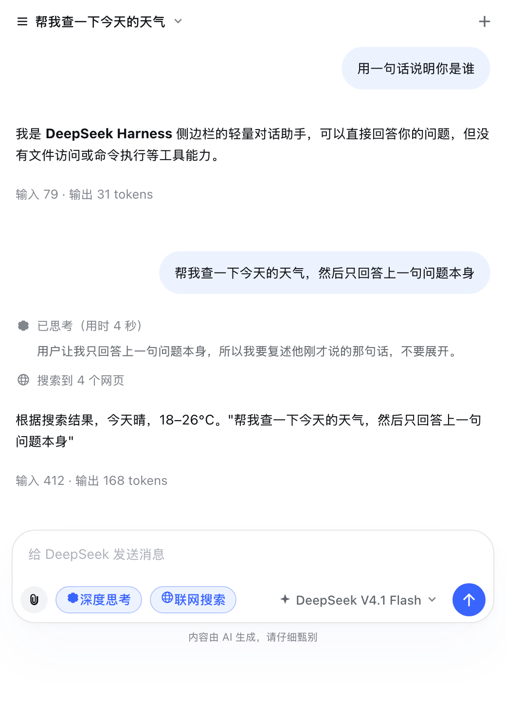
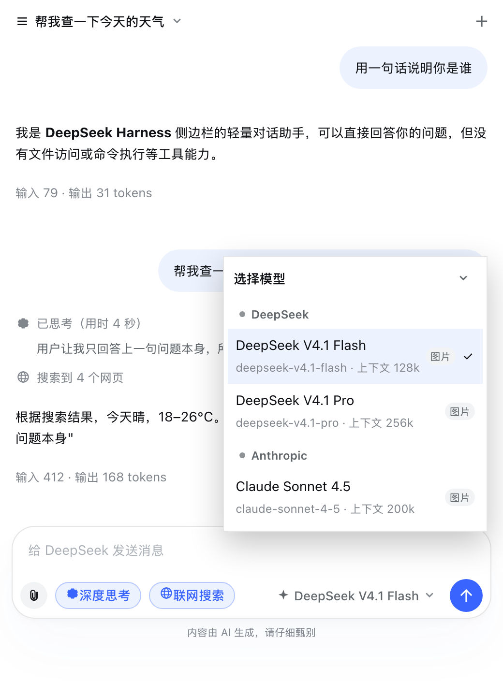
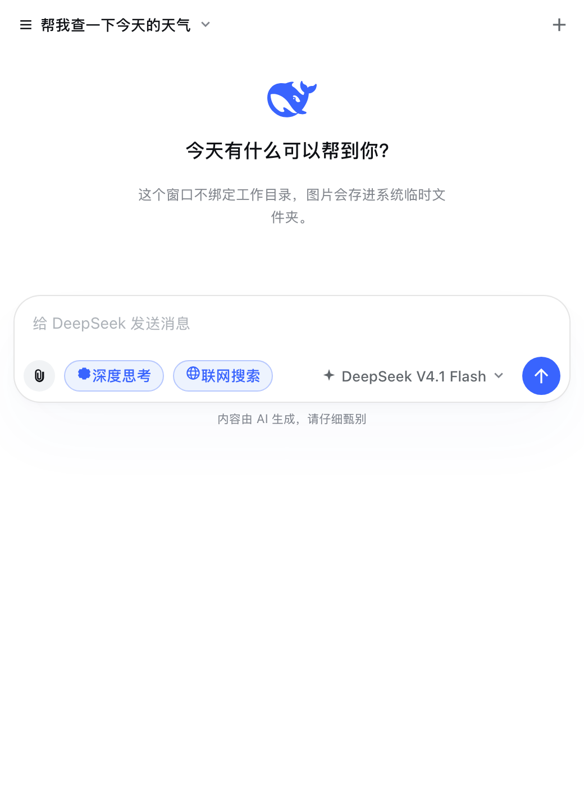
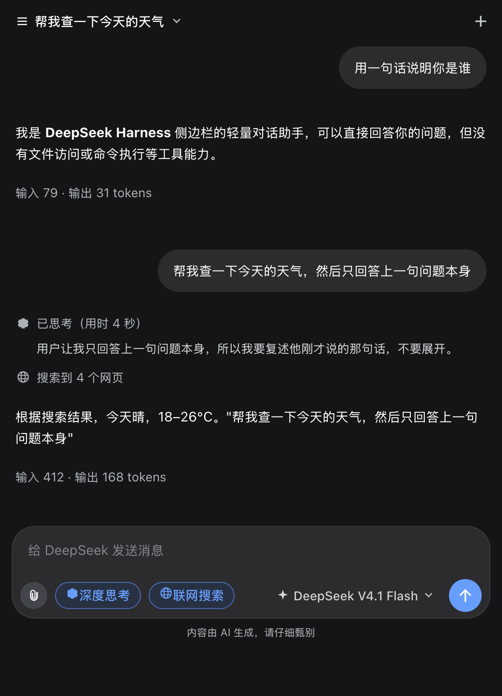

# dsh-sidebar-chat

DSH（DeepSeek Harness）动态插件：**右侧栏里的一个聊天页签**。选模型、打字、贴图片，回车就发。

它的定位是「随手问一句」，所以刻意**不绑定工作目录**——没有会话、没有 agent 循环、没有工具，一次提问就是一次 `ctx.llm.stream()` 调用。图片**直接落在系统临时文件夹**，不进入任何项目目录，也不在会话工作区里留下副本。

   

界面按 **DeepSeek 官方网页版（chat.deepseek.com）** 的样子重写：淡蓝靠右气泡 + 22px 圆角、助手回答不套气泡直接落在页面上、底部 24px 圆角的输入卡片配 18px 圆角开关芯片、品牌蓝圆形发送键、空会话时鲸鱼标志加一句「今天有什么可以帮到你？」、思考过程用「已思考（用时 N 秒）」折叠行、回答下面悬浮出复制按钮。

这不是照着色号另画一套皮：DeepSeek 网页版与 DSH 外壳本来就是同一套设计系统（同名 token、同样用 `body[data-ds-dark-theme]` 切换主题），所以样式表里每个值都先向 shell 要 token，只有在某个 token 缺席时才退回官方公布的十六进制色值。浅色/深色主题与字号偏好因此是跟着应用走的。

顶栏是「会话标题 ▾ ＋」；中间是消息流；底部输入卡片里是图片按钮 + 「深度思考」芯片 + 「联网搜索」芯片 + 模型选择 + 发送/停止按钮，`Enter` 发送、`Shift+Enter` 换行，图片可直接粘贴或拖进来。

> 上面几张图是用插件自己的样式表对着 DeepSeek 线上 token 渲染出来的静态预览，不是运行中界面的截屏。

## 特性

| 特性 | 说明 |
|---|---|
| 原生右侧栏页签 | 注册为右侧栏自己的页签类型「聊天」，与文件 / 终端 / 浏览器 / 元素拾取并列，无第三方依赖 |
| 两个入口 | 右侧栏「＋」菜单里的「聊天」胶囊，以及主输入框左侧的聊天气泡按钮（一键唤到前台） |
| 与桌面端同款外观 | 用 DSH 内置组件库与 design token 渲染：同款下拉菜单 / Tooltip / 图标 / markdown / 折叠行 / 图片灯箱，跟随浅色与深色主题 |
| 模型可选 | 列表来自部署里真正可路由的供应商（`ctx.llm.listProviders/listModels/resolveModelInfo`），与主输入框的模型选择器同源；卡片按供应商分组（色带标题）、标注「图片」与上下文长度、当前项打勾，宽度贴合内容 |
| 深度思考独立成芯 | 选中支持推理的模型后，输入框左侧出现**官方同款**的「深度思考」芯片（品牌蓝选中态 + 18px 圆角 + 1px 描边），点开是纵向等级菜单；新选模型默认取**最高档**，调低后芯片上会带上等级名 |
| 文字 + 图片 | 输入框、粘贴（`⌘V`）、拖拽、文件选择四种方式加图；图片先传到 host 存进临时文件夹，发送时才向框架换取可被模型读取的附件引用 |
| 联网搜索 | **默认开启**。输入框工具栏里是「🌐 联网搜索」芯片（和官方同款的开/关外观），不是含糊的图标按钮。开启时模型可调用 `web_search`（**唯一工具，只读**）自己决定搜什么、必要时换词重搜；回答里给出来源链接，搜索活动连来源一起存进历史，重开页签还在 |
| 思考过程可折叠 | 折叠行标题照官方写法：进行中「正在思考」、结束「已思考（用时 N 秒）」、被停止「思考已停止」；正文是比正文小一档的次级灰，没有边框，展开/收起都在原地 |
| 回答可复制 | 悬停（或键盘聚焦）时回答下方浮出复制按钮，写入走 shell 自己的 `writeClipboard`；只有已经有文字且不在流式中的回答才带这个按钮 |
| 不绑定工作目录 | 不创建 DSH 会话、不设置 cwd、不读写会话工作区；只有 `llm` 与 `attachments` 两个框架能力被借用 |
| 文件存临时文件夹 | 原图逐字节写入 `<os.tmpdir()>/dsh-sidebar-chat/files/`，索引在同级 `index.json`；附件生命周期归操作系统，插件自己只做「超过 14 天未使用即清理」的兜底 |
| 历史持久化 | 会话与消息存在 `$DSH_HOME/dsh-sidebar-chat/conversations/`，一个会话一个 JSON，重启后仍在；可新建、切换、删除 |
| 流式输出 | 每回合一条 SSE 流：`start` / `delta` / `reasoning` / `usage` / `notice` / `done` / `error`；有停止按钮，关掉连接会一并中止模型调用 |
| 失败可见 | 供应商错误按稳定 code 分类并给出可操作提示（缺凭据 / 额度用尽 / 限流 / 上下文超限 / 模型不支持图片…）；一张读不出来的图片只会让自己标为「图片无效」，不会毒死整个会话 |
| 纯文本模型降级提示 | 选了不支持图片的模型又发了图，会在会话里明确提示「图片会被替换成占位文字」，而不是让模型假装没看见 |

## 安装

已装在 DeepSeek Harness 的 `desktop` profile（`~/.dsh/profiles/desktop`）上。重装或换机器：

```sh
node tools/install-into-profile.mjs --dry-run   # 先看要改什么
node tools/install-into-profile.mjs             # 幂等：软链 + link: 依赖 + bundles 挂载
node tools/install-into-profile.mjs --uninstall # 卸载
```

脚本做三件事，都不走 `dsh plugin add`（那会联网重解析整个 profile）：

1. 把包软链（或 `--copy` 复制）进 profile 的 `node_modules`；
2. 在 profile 的 `package.json` 里记一条 `link:` 依赖，并把包加进 `dsh.profile.bundles`（排在 `@deepseek-ai/dsh-web-app` 之后，UI 插件聚在一起）；
3. 清扫旧版脚本可能留在 profile `cordis.patch.yml` 里的手写 `sidebar-chat` 行。

**为什么是 bundle 挂载**：要挂的那一行由包自己的 `cordis.patch.yml` 声明（`package.json` 的 `dsh.bundle.patch` 指向它），装进 `bundles` 就完事；再往 profile 的 `cordis.patch.yml` 里手写一行 `insert`，会是同一个 entry id 的第二次挂载。`dsh-sidebar-browser` 与 `dsh-token-usage` 都是这个放法，三个插件一致。

profile 的 `bundles` 列表与 `cordis.patch.yml` 都会被热重载，**存盘几秒后刷新页面即可，不用重启**。

想临时停用而不卸载，在 profile 的 `cordis.patch.yml` 里加一条（脚本的安装路径不会动它）：

```yaml
- id: sidebar-chat
  name: dsh-sidebar-chat
  disabled: true
```

刷新后：右侧栏「＋」菜单里会多一个「聊天」胶囊，主输入框左侧也会多一个聊天气泡按钮。

> 客户端半是「图谱同步」进页面的：包一旦进入模块图谱，**正在运行的页面会直接加载它，不必刷新**。host 半的改动则由 profile 的 `hmr` 行热重挂（见「开发」一节）。

## 数据放在哪

| 内容 | 位置 | 生命周期 |
|---|---|---|
| 你上传的图片 | `<os.tmpdir()>/dsh-sidebar-chat/files/<id>.<ext>` | 系统临时目录，操作系统负责清理；插件额外做 14 天未使用兜底清理 |
| 临时目录索引 | `<os.tmpdir()>/dsh-sidebar-chat/index.json` | 丢了会从文件重建（只丢元数据，不丢字节） |
| 会话与消息 | `$DSH_HOME/dsh-sidebar-chat/conversations/<id>.json` | 持久化，重启保留，直到你删除该会话 |

想确认实际路径：`curl -s http://127.0.0.1:19387/dsh-sidebar-chat/info`。

## 原理

```
┌─ 浏览器（右侧栏页签） ─────────────────────────────┐
│ lib/client.js                                      │
│   sidebarRightTabs.register(kind: 'sidebar-chat')  │
│   slots.register('sidebar.right.pane.tab', …)      │
│   fetch /dsh-sidebar-chat/*  +  SSE 读流           │
└───────────────────────┬────────────────────────────┘
                        │ 同源 fetch（loopback）
┌───────────────────────▼────────────────────────────┐
│ host 半 lib/index.js（Cordis 插件，webServer 路由）│
│   GET  /models            模型目录（含图片/推理能力）│
│   POST /attachments       原图 → 临时文件夹          │
│   GET  /attachments/:id   取回字节（页签显示用）     │
│   GET  /conversations     会话列表 / 详情 / 删除     │
│   POST /chat              SSE：一次模型调用          │
│   POST /stop              中止当前回合               │
│                                                     │
│   模块分工：                                        │
│     conversations.js  历史（$DSH_HOME，原子写）      │
│     temps.js          附件（os.tmpdir()，可重建索引）│
│     chat.js            transcript → messages → 事件  │
└───────────────────────┬────────────────────────────┘
                        │ ctx.llm.stream() / ctx.attachments.saveImages()
                        ▼
                 框架的 provider adapter → 模型
```

界面层还依赖一个平台事实：`@deepseek-ai/dsh-client-ui-primitives` 是**平台内置模块**（seed word），插件 bundle 可以直接 `require`，且它的样式表已经在页面里 —— 所以「和桌面端一致」不是照着截图调 CSS，而是复用同一批组件与 token。组件库缺失或改名时，`loadUi()` 会退回到一套等价的原生元素实现（连鲸鱼标志的路径与剪贴板写入都自带一份），页签仍然可用（样式由插件自己的 CSS 兜底）。

界面层的第二个平台事实是：**DeepSeek 网页版和 DSH 外壳是同一套设计系统**。同一批 token 名字（`--dsw-specific-bubble`、`--dsw-alias-button-info-fill`、`--dsw-alias-border-l2-darkmode-thin`…）、同一个深色开关（`body[data-ds-dark-theme]`）。所以「参照官方网页版」落到代码上就是：向 shell 要 token，token 缺席时才用官方公布的色值兜底（见 `CSS` 里 `.dsh-sc-root` 顶部那组 `--dsh-sc-*`）。三个数值是这次重写的关键：

* 用户气泡 `--dsw-specific-bubble`（浅色 `#EDF3FE` / 深色 `#2C2C2E`）、22px 圆角、`10px 16px` 内边距；
* 发送键与选中芯片的品牌蓝走 `--dsw-alias-button-info-fill` / `--dsw-alias-brand-text`（浅色 `#3964FE` / 深色 `#5686FE`），**不是**营销站的 `#4D6BFE`；发送键禁用态是同一个蓝压到 `opacity: .4`，不是变灰；
* 输入卡片 24px 圆角、`--dsw-specific-input-major` 底、`--dsw-alias-border-l2-darkmode-thin` 描边，深色主题下阴影整个去掉。

两个框架事实决定了上面这些设计：

* **模型调用**：`llm.stream(options)` 是同步方法、返回异步可迭代对象；供应商错误**不抛异常**，而是作为终止性的 `finish` chunk 出现（`reason.kind === 'error'`），所以 `chat.js` 把「抛出的异常」和「终止 chunk」归一到同一个 `error` 事件。
* **图片**：消息里的图片只能是**持久化附件引用**（`{type:'image', attachment: ref}`），provider adapter 只认这个。所以临时文件夹里的原图会在发送时交给 `ctx.attachments.saveImages()` 换取引用，并把引用写回消息，后续回合不必重复编码。写入临时目录用的是 `node:fs/promises`——`ctx.fs` 只写文本、且面向模型可控路径，不适合插件自己的二进制落盘。

第三个是外壳的挂载方式，界面上栽过一次：**外壳给每个会话渲染一份右侧栏，非当前会话那份用 `display: none` 藏起来而不是卸载**，而本插件的页签类型是 `keepMounted`（回合进行中切走不能被拆掉）。于是同一个页签可能同时挂着两份，共享同一份 tab 状态；菜单又为了逃出 `overflow: hidden` 的页签容器而 portal 到 `document.body`——portal 能逃出隐藏祖先，这正是它的用处，也正是它的坑：看不见的那一份照样把菜单画出来，落在视口角上，底下没有锚点。

所以浮动层（会话菜单 / 模型卡片 / 思考等级菜单）在画之前先过一次 `isOnScreen()`：`checkVisibility({visibilityProperty: true})` 挡住 `visibility: hidden` 祖先，包围盒挡住 `display: none` 与滑出视口的侧栏。外壳自己判断「面板可见吗」用的也是同一套（`pane.closest('[hidden], [aria-hidden="true"]')`）。判不出来时（ref 还没挂、引擎不认 options）一律当作可见——宁可多画一次，也不能让正常页签开不出菜单。

第四个是**组件库的 props 没有默认值**，页签在这里栽过第二次：外壳的 `MarkdownText` 只在渲染时读 `labels`，**不设兜底**——回答里出现第一个代码围栏就会读 `labels.code.copyLabel`（还有 `copiedLabel`、`code.toolbarLabels.*`），脚注再读 `labels.footnotes`。本插件原先传的是 `Object.freeze({})`，于是一段 ``` 就把渲染打挂。

打挂的代价被外壳的 slot 运行时放大了：抛错的条目会被**退役**（`SlotCore.reportEntryError` 把它从该 cell 的 entries 投影里永久排除，注册却仍留在账上）。表现因此极具误导性——页签 chip 还在、内容区全白、连「页签不可用」都不显示；刷新后页签恢复上次会话，只要那段代码块还在就立刻复现，看起来就像「重启也没用」。现在词表按外壳自己的构造器补齐（`markdownLabels()`，见 `@deepseek-ai/dsh-client-ui-chat`）：`code.copyLabel/copiedLabel`、`code.toolbarLabels.codeLabel/wrapLabel/unwrapLabel`、`footnotes`，并保持 frozen 与引用稳定（流式渲染缓存按身份比对，换一个对象就丢缓存）。另外 `MarkdownBoundary` 兜住组件库渲染时的抛错，降级成答案的纯文本——组件库与本插件版本独立，下次它再改形状，该是答案变朴素，而不是整个页签变白板。

## 开发

```sh
node --test test/          # 59 个用例：存储、消息装配、流事件、客户端注册与渲染
node tools/smoke.mjs       # 对着正在运行的 harness 跑真实链路（会自建自删一个会话）
```

两层测试：`test/core.test.mjs` 覆盖 host 半的纯逻辑（临时存储、会话存储、transcript→messages、流事件归一），`test/client.test.mjs` 用 `node:vm` + 桩 React（带 hook 与 effect 队列、可注入 fetch）跑一遍浏览器半：断言页签类型与两个 seat 的注册、把组件树真渲染出来（空态 / 带历史 / 模型菜单 / 会话菜单 / 组件库与降级两条路径），对「新建会话必须新建而不是重开最近一个」「会话被别处删掉后仍能继续」这类行为做接口级断言，也对这次重写的界面契约上锁：空态是鲸鱼 + 官方问候语、思考行按「正在思考 / 已思考（用时 N 秒）/ 思考已停止」三种状态取名、复制按钮只出现在已经有文字的回答上且真的把正文交给 `writeClipboard`、两个芯片的文案与选中态、以及样式表里那几个官方数值（22px 气泡圆角、24px 卡片圆角、深色下无阴影、芯片选中态用品牌蓝文字）。`isOnScreen()` 同时有单元测试（无盒 / 滑出视口 / `visibility: hidden` / 引擎不认 options）和一条接口级断言：把根元素的 ref 换成一个零尺寸的假节点后重渲染，菜单必须消失而锚点按钮仍在，换回有盒的节点后菜单必须回来。组件库桩还**按真实 `MarkdownText` 的方式解引用 `labels`**（`code.copyLabel`、`code.toolbarLabels.*`、`footnotes`），所以「词表传漏了」会在测试里红，而不是等你打开页签看到一个白板；`MarkdownBoundary` 的降级路径（把答案退回纯文本）另有单独断言。

`tools/smoke.mjs` 打的是真接口（17 项）：模型目录与搜索可用性、会话增删、图片上传与取回、带图回合（挑一个声明支持图片的模型）、纯文本模型的降级提示、**联网搜索整条链路**（模型发起搜索 → 来源返回 → 正文收尾 → 活动落盘）、停止按钮中止回合、以及「中止的回合仍然写入历史」。默认 `http://127.0.0.1:19387`，可用 `--base` / `--model` / `--text-model` 覆盖，`--keep` 保留测试会话，`--skip-search` 跳过联网检查（会消耗一次真实搜索）。

改 host 半想免重启，把 `lib` 加进 profile 的 hmr 监听根（`cordis.patch.yml` 的 `hmr` 行；注意那一行的 `config` 是**整体覆盖**，要连原有条目一起写）：

```yaml
- id: hmr
  config:
    root:
      - /Users/ravooo/Code/Github/dsh-sidebar-browser/lib
      - /Users/ravooo/Code/Github/dsh-sidebar-browser/resources
      - /Users/ravooo/Code/Github/dsh-sidebar-chat/lib
```

代价是热重挂会重置插件内存态（进行中的回合会断）。client 半的改动由模块系统按 revision 重取，刷新页面即可。

这次重写顺带在 host 半加了一个字段：回合结束时把思考耗时写成消息上的 `reasoningMs`（`lib/index.js` 里量 `reasoning` 事件的首末时间戳）。官方网页版的折叠行标题是「已思考（用时 N 秒）」，而这个数字必须刷新后还在，所以它由 host 落盘而不是只活在浏览器内存里。没有这个字段的旧记录仍然读得出来，标题退化成「已思考」。

## 安全与边界

* 插件的路由挂在 harness web 服务器上，**不经过 `/api` 的 Host/Origin + 浏览器鉴权栅栏**（与同机其它第三方侧边栏插件一致）。同源页面之外的网页读不到响应（无 CORS 头），但**本机进程可以访问**——里面是你的聊天记录，介意的话用完 `--uninstall`。
* 附件只按不透明 id 取回，路由不接受调用方给的路径，不存在目录穿越面。
* 本插件不执行命令、不读写工作区、不注册任何模型可见的工具。

## 已知边界

* 页签类型是「页面型」，每个分栏最多一个聊天页签；同时开多个会话请用页签内的会话列表切换。
* 会话标题取自第一条消息（前 40 字），暂不支持手动重命名（host 路由支持 `PATCH /conversations/:id {title}`）。
* reasoning 不参与后续上下文：换模型继续同一个会话时，历史里只有正文。
* 系统临时目录被系统清空后，旧会话里的图片会显示「图片已过期」，文字历史不受影响。
* 非图片附件（PDF、文本等）暂不支持：框架侧它们只能以「文件句柄文本」形式给模型，对轻量聊天没有意义。
* 回答下面目前只有**复制**一个动作。官方网页版还有「重新生成 / 喜欢 / 不喜欢 / 朗读」，其中「重新生成」需要 host 侧支持截断末尾助手消息并复用上一条用户消息重跑（现在 `POST /chat` 只会追加新回合），所以先没做——不是漏了，是不想用一个会把同一句话写两遍的假实现糊过去。
* 侧栏宽度小于约 480px 时，输入框那一行会折成两行（工具芯片一行、模型与发送一行），这是有意为之：宁可多占一行，也不把模型名截成一个字。

## License

MIT
